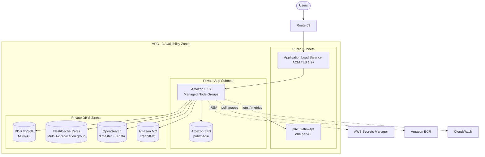

# AWS Infrastructure Architecture Guide

Reference architecture for running a containerised, stateful web application (Magento / Adobe Commerce-style stack: MySQL, Redis, OpenSearch, RabbitMQ, shared media) on AWS using fully managed services and Kubernetes (Amazon EKS).

---

## Table of Contents

1. [Architecture Overview](#architecture-overview)
2. [AWS Service Mapping](#aws-service-mapping)
3. [Network Design](#network-design)
4. [Security](#security)
5. [Secrets Management](#secrets-management)
6. [Monitoring & Alerting](#monitoring--alerting)
7. [Deployment Order](#deployment-order)
8. [Operational Notes](#operational-notes)
9. [Version & Support Checklist](#version--support-checklist)

---

## Architecture Overview



---

## AWS Service Mapping

| Component | AWS Managed Service | Configuration Details |
|---|---|---|
| Networking | Amazon VPC | 3 Availability Zones; public, private-app and private-DB subnets; one NAT Gateway per AZ (multi-AZ) |
| Container Orchestration | Amazon EKS | Managed Node Groups in private subnets; IRSA or EKS Pod Identity; EBS CSI driver, EFS CSI driver, CoreDNS add-ons; use a currently supported Kubernetes version (see [checklist](#version--support-checklist)) |
| Ingress / Load Balancing | Application Load Balancer | Provisioned by the AWS Load Balancer Controller; HTTP-to-HTTPS redirect; ACM certificate; TLS 1.2+ security policy |
| Container Registry | Amazon ECR | Private repositories, KMS encryption, scan on push, lifecycle rules |
| Database | Amazon RDS for MySQL | Multi-AZ standby, private DB subnet group, automated daily backups/snapshots, storage autoscaling, encryption at rest (KMS) |
| Cache & Sessions | Amazon ElastiCache for Redis | Multi-AZ replication group with automatic failover, **cluster mode disabled** (see note below), in-transit and at-rest encryption |
| Catalog Search Engine | Amazon OpenSearch Service | VPC deployment, 3 dedicated master nodes, 3 data nodes across 3 AZs, zone awareness enabled |
| Message Queuing | Amazon MQ for RabbitMQ | Multi-AZ **cluster** deployment (3 nodes) for production, single-instance for non-production; TLS (AMQPS) on port 5671 |
| Secrets Vault | AWS Secrets Manager | No plaintext secrets in Git; randomly generated passwords; automated rotation where supported |
| Shared Media Storage | Amazon EFS | EFS CSI driver, `ReadWriteMany` PersistentVolume mounted at `pub/media`; mount targets in every app AZ |
| Monitoring & Logs | Amazon CloudWatch | Container Insights, structured JSON logging, alarms (see [Monitoring](#monitoring--alerting)) |
| DNS & Certificates | Amazon Route 53 & AWS Certificate Manager | Public hosted zone; ACM certificates validated automatically via DNS validation |

> **Note on Redis cluster mode:** Magento's Redis integration does not support Redis Cluster (sharded) mode. Use a **cluster-mode-disabled** replication group (one primary plus replicas across AZs) with automatic failover enabled. If you need separate cache and session stores, use two replication groups or separate logical databases.

---

## Network Design

| Tier | Subnets | Contains |
|---|---|---|
| Public | 3 (one per AZ) | ALB, NAT Gateways |
| Private App | 3 (one per AZ) | EKS worker nodes, EFS mount targets |
| Private DB | 3 (one per AZ) | RDS, ElastiCache, OpenSearch, Amazon MQ |

- One NAT Gateway per AZ so an AZ failure does not remove outbound access for the other AZs.
- Private DB subnets have **no route to the internet**.
- Tag subnets for the AWS Load Balancer Controller:
  - Public: `kubernetes.io/role/elb = 1`
  - Private app: `kubernetes.io/role/internal-elb = 1`
- Consider VPC endpoints (S3 gateway endpoint; interface endpoints for ECR, STS, Secrets Manager, CloudWatch Logs) to reduce NAT cost and keep traffic on the AWS network.

---

## Security

### Private worker nodes
All EKS worker nodes run in private application subnets. Direct SSH access and public IP assignment are disabled; use AWS Systems Manager Session Manager if node access is required.

### Strict security group ingress
RDS, ElastiCache, OpenSearch, Amazon MQ **and EFS** accept traffic only from the EKS worker nodes security group (`eks_nodes_sg`) on their service ports:

| Service | Port |
|---|---|
| RDS MySQL | 3306 |
| ElastiCache Redis | 6379 |
| OpenSearch (HTTPS) | 443 |
| Amazon MQ RabbitMQ (AMQPS) | 5671 |
| EFS (NFS) | 2049 |

### Least-privilege IAM
Pods use IAM Roles for Service Accounts (IRSA) or EKS Pod Identity to obtain short-lived STS credentials for AWS Secrets Manager (and S3, if used) without storing AWS access keys in containers. Scope each role to the specific secret ARNs and bucket prefixes the workload needs.

### Encryption
- **At rest:** KMS for ECR, RDS, EFS, ElastiCache, OpenSearch, Amazon MQ and EBS volumes.
- **In transit:** TLS 1.2+ on the ALB, ElastiCache, OpenSearch, RabbitMQ and RDS connections.

---

## Secrets Management

- Secrets live in **AWS Secrets Manager**; nothing sensitive is committed to Git.
- Passwords are generated randomly at provisioning time.
- RDS master credentials can use RDS-managed secrets with automatic rotation.
- Workloads read secrets at runtime via IRSA / Pod Identity (for example with the Secrets Store CSI Driver + AWS provider, or External Secrets Operator).

---

## Monitoring & Alerting

- **Container Insights** for cluster, node and pod metrics.
- **Structured JSON logging** from application containers, shipped to CloudWatch Logs.
- **Baseline alarms:**

| Alarm | Threshold |
|---|---|
| RDS `CPUUtilization` | > 80% |
| ElastiCache `DatabaseMemoryUsagePercentage` | > 85% |

- Recommended additions: RDS free storage and connections, OpenSearch cluster status and JVM pressure, Amazon MQ queue depth and memory alarms, ALB 5xx rate and target health.

---

## Deployment Order

1. **Networking:** VPC, subnets, route tables, NAT Gateways, security groups.
2. **KMS keys and Secrets Manager** secrets.
3. **Data tier:** RDS, ElastiCache, OpenSearch, Amazon MQ, EFS (with mount targets).
4. **ECR** repositories; build and push images.
5. **EKS cluster** and managed node groups; install add-ons (CoreDNS, kube-proxy, VPC CNI, EBS CSI, EFS CSI).
6. **IAM:** OIDC provider / Pod Identity associations and service account roles.
7. **Cluster controllers:** AWS Load Balancer Controller, Container Insights agents, secrets integration.
8. **Route 53 hosted zone and ACM certificate** (DNS validation).
9. **Application deployment:** manifests or Helm chart, Ingress (ALB), EFS PersistentVolumeClaim for `pub/media`.
10. **Alarms and dashboards** in CloudWatch.

Connect to the cluster:

```bash
aws eks update-kubeconfig --region <region> --name <cluster-name>
kubectl get nodes
```

---

## Operational Notes

- **Backups:** RDS automated backups with a defined retention period; consider AWS Backup for EFS and cross-region copies.
- **Scaling:** Cluster Autoscaler or Karpenter for nodes, Horizontal Pod Autoscaler for pods, RDS storage autoscaling.
- **Failover:** Test RDS Multi-AZ failover, ElastiCache failover and node-group AZ loss before go-live.
- **Cost:** Multi-AZ NAT Gateways, dedicated OpenSearch masters and the RabbitMQ cluster are the main fixed costs; use non-production sizing for dev/test.

---

## Version & Support Checklist

Managed-service versions reach end of standard support on a schedule. Before provisioning, confirm each version is currently supported and compatible with your application release:

| Service | Version in this design | Check |
|---|---|---|
| Amazon EKS | 1.30 | Older Kubernetes versions move into paid extended support and then forced upgrade; choose the newest version your add-ons support |
| RDS MySQL | 8.0 | MySQL 8.0 community support has ended; RDS Extended Support fees may apply. Consider 8.4 LTS if your application supports it |
| ElastiCache Redis | 7.1 | Confirm engine availability (Valkey is also offered) |
| OpenSearch | 2.11 | Confirm compatibility with your application's supported search engine versions |
| Amazon MQ RabbitMQ | 3.13 | Confirm currently supported broker versions |

Always verify against the current AWS documentation and your application's system requirements.
