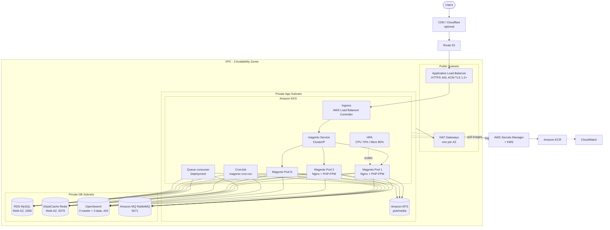

# Magento 2 / Adobe Commerce on AWS: Enterprise DevOps Architecture

Reference architecture for running **Adobe Commerce / Magento Open Source 2.4.7** on **Amazon EKS** with AWS managed services. It provides autoscaling, zero-downtime rolling deployments, isolated private networking, multi-AZ resilience and centralised observability.

---

## Table of Contents

1. [System Overview](#1-system-overview)
2. [AWS Service Mapping](#2-aws-service-mapping)
3. [Network Design](#3-network-design)
4. [Application Workloads on EKS](#4-application-workloads-on-eks)
5. [Data, Cache & Persistence](#5-data-cache--persistence)
6. [Secrets Management](#6-secrets-management)
7. [Security](#7-security)
8. [Monitoring & Alerting](#8-monitoring--alerting)
9. [CI/CD & Zero-Downtime Deployments](#9-cicd--zero-downtime-deployments)
10. [Deployment Order](#10-deployment-order)
11. [Operational Notes](#11-operational-notes)
12. [Version & Support Checklist](#12-version--support-checklist)

---

## 1. System Overview



Key design choices:

- Each Magento pod runs **Nginx and PHP-FPM containers** side by side and mounts shared media from EFS.
- The ALB sends traffic **directly to pod IPs** (`alb.ingress.kubernetes.io/target-type: ip`) through a `ClusterIP` Service. This avoids the extra NodePort hop and gives more accurate health checks.
- Static assets (`pub/static`) and compiled code are **baked into immutable Docker images** in CI/CD, so there is no runtime NFS latency for them.
- Cron and queue consumers run as separate workloads, not inside web pods.

---

## 2. AWS Service Mapping

| Component | AWS Managed Service | Configuration Details |
|---|---|---|
| Networking | Amazon VPC | 3 AZs; public, private-app and private-DB subnets; one NAT Gateway per AZ |
| Container Orchestration | Amazon EKS | Managed Node Groups in private subnets; IRSA or EKS Pod Identity; EBS CSI, EFS CSI, CoreDNS, VPC CNI, kube-proxy add-ons; Kubernetes Secrets envelope encryption with KMS; use a currently supported version |
| Ingress / Load Balancing | Application Load Balancer | Provisioned by AWS Load Balancer Controller; HTTP-to-HTTPS redirect; ACM certificate; TLS 1.2+ policy |
| Container Registry | Amazon ECR | Private repos, KMS encryption, scan on push, lifecycle rules, immutable tags |
| Database | Amazon RDS for MySQL | Multi-AZ synchronous standby, private DB subnets, automated backups, Performance Insights / Database Insights, storage autoscaling, KMS encryption |
| Cache & Sessions | Amazon ElastiCache for Redis | Multi-AZ replication groups with automatic failover, **cluster mode disabled**, in-transit and at-rest encryption |
| Catalog Search | Amazon OpenSearch Service | VPC deployment, zone awareness across 3 AZs, 3 dedicated master nodes, 3 data nodes |
| Message Queuing | Amazon MQ for RabbitMQ | Multi-AZ **cluster** deployment (3 nodes) in production; single-instance for non-production; AMQPS on port 5671 |
| Secrets Vault | AWS Secrets Manager + KMS | No plaintext secrets in Git; random passwords; rotation where supported |
| Shared Media Storage | Amazon EFS | EFS CSI driver, `ReadWriteMany` volume for `pub/media`; mount targets in every app AZ |
| Monitoring & Logs | Amazon CloudWatch | Container Insights, structured JSON logs, alarms |
| DNS & Certificates | Route 53 & ACM | Public hosted zone; ACM certificates with DNS validation |
| CDN / Edge (optional) | CloudFront or Cloudflare | Caches static and media assets; WAF and bot protection |

---

## 3. Network Design

| Tier | Subnets | Contains |
|---|---|---|
| Public | 3 (one per AZ) | ALB, NAT Gateways |
| Private App | 3 (one per AZ) | EKS worker nodes, EFS mount targets |
| Private DB | 3 (one per AZ) | RDS, ElastiCache, OpenSearch, Amazon MQ (no route to the internet) |

- Tag public subnets `kubernetes.io/role/elb = 1` and private app subnets `kubernetes.io/role/internal-elb = 1`.
- Consider VPC endpoints (S3 gateway; interface endpoints for ECR, STS, Secrets Manager, CloudWatch Logs) to reduce NAT cost and keep traffic on the AWS network.
- If a CDN such as Cloudflare fronts the ALB, restrict ALB ingress to the CDN's IP ranges (or use a secret origin header) and configure Magento/Nginx to trust the forwarded client IP.

---

## 4. Application Workloads on EKS

| Workload | Kind | Notes |
|---|---|---|
| Magento web | Deployment (Nginx + PHP-FPM) | Rolling updates, readiness/liveness probes, `preStop` delay, PodDisruptionBudget, topology spread across AZs |
| Autoscaling | HorizontalPodAutoscaler | Target CPU 70%; memory (80%) can be added but is a weak signal for PHP-FPM, so CPU or request-based metrics are preferred |
| Scheduled tasks | CronJob | `magento cron:run` every minute, `concurrencyPolicy: Forbid`, bounded history, resource limits |
| Async consumers | Deployment | Runs `bin/magento queue:consumers:start <name>` workers against RabbitMQ; scale independently of web |
| Schema upgrades | Job (pre-deploy) | Runs `setup:upgrade` once per release, not from every pod at startup |
| Media | PVC (EFS, RWX) | Mounted at `pub/media` in web, cron and consumer pods |

Pods use a dedicated ServiceAccount bound to an IAM role (IRSA or Pod Identity) for Secrets Manager access.

---

## 5. Data, Cache & Persistence

### Relational database
- Amazon RDS MySQL in private DB subnets with Multi-AZ synchronous standby replication.
- Automated backups, Performance Insights / Database Insights, and storage autoscaling.
- Consider a read replica for reporting or split-database setups.

### Redis cache and sessions
Use **cluster-mode-disabled** replication groups (Magento does not support Redis Cluster mode), with automatic failover across AZs.

| Purpose | Redis DB | Recommended eviction policy |
|---|---|---|
| Default cache | 0 | `allkeys-lru` |
| Full Page Cache (FPC) | 1 | `allkeys-lru` |
| PHP sessions | 2 | `noeviction` (or `volatile-lru`) |

> **Important:** eviction policy is set per Redis instance (parameter group), not per logical database. A single `allkeys-lru` instance can evict live customer sessions and log users out or empty carts under memory pressure. For production, use **two replication groups**: one for cache and FPC (`allkeys-lru`) and a separate one for sessions (`noeviction`, sized with headroom and monitored on memory).

### Search
Amazon OpenSearch Service, VPC-deployed, zone-aware across 3 AZs, with 3 dedicated master nodes and 3 data nodes. Use a version supported by your Magento release.

### Messaging
Amazon MQ for RabbitMQ as a multi-AZ cluster. Connect over TLS (port 5671) and set `ssl` options in Magento's queue configuration.

### Shared media
`pub/media` (product images, catalog media, uploads) lives on Amazon EFS via the EFS CSI driver (`ReadWriteMany`). Use General Purpose performance mode and Elastic throughput unless benchmarking shows otherwise. Serve media through a CDN to limit EFS reads.

---

## 6. Secrets Management

- **phpMyAdmin is never a secrets vault.** It is an interactive SQL tool for local debugging only. Never store application passwords, AWS credentials or API tokens in database tables through it, and do not expose it in production.
- **Local development:** `.env` derived from `.env.example`, gitignored.
- **Kubernetes:** secrets are injected as environment variables (`envFrom`) or mounted files. Standard Kubernetes Secrets are only base64-encoded, so enable **EKS envelope encryption with KMS** and restrict RBAC access to them.
- **Production AWS:** AWS Secrets Manager encrypted with KMS. Pods fetch values through IRSA / Pod Identity, via the Secrets Store CSI Driver (AWS provider) or External Secrets Operator.
- **Terraform:** no plaintext passwords in Git. Passwords come from `random_password` and are stored in Secrets Manager immediately. Note that **generated values also exist in Terraform state**, so keep state in an encrypted, access-controlled backend (S3 with KMS and locking). For RDS, prefer `manage_master_user_password = true` so AWS creates and rotates the master secret and it never enters state.

---

## 7. Security

### Private worker nodes
All EKS worker nodes run in private app subnets. SSH and public IPs are disabled; use AWS Systems Manager Session Manager if node access is needed.

### Security group ingress
Data services accept traffic only from the EKS worker nodes security group (`eks_nodes_sg`):

| Service | Port |
|---|---|
| RDS MySQL | 3306 |
| ElastiCache Redis | 6379 |
| OpenSearch (HTTPS) | 443 |
| Amazon MQ RabbitMQ (AMQPS) | 5671 |
| EFS (NFS) | 2049 |

### Least-privilege IAM
IRSA or Pod Identity provides short-lived STS credentials to pods, with no AWS access keys in containers. Scope each role to the specific secret ARNs (and S3 prefixes, if S3 is used).

### Encryption
- **At rest:** KMS for ECR, RDS, EFS, ElastiCache, OpenSearch, Amazon MQ, EBS and Kubernetes Secrets.
- **In transit:** TLS 1.2+ on the ALB, Redis, OpenSearch, RabbitMQ and RDS connections.

### Admin hardening
Restrict the Magento admin URL (custom path, IP allow-list or WAF rule), enable 2FA, and consider AWS WAF on the ALB.

---

## 8. Monitoring & Alerting

- Container Insights for cluster, node and pod metrics.
- Structured JSON logs from Nginx, PHP-FPM and Magento to CloudWatch Logs.
- Baseline alarms:

| Alarm | Threshold |
|---|---|
| RDS `CPUUtilization` | > 80% |
| ElastiCache `DatabaseMemoryUsagePercentage` | > 85% |

- Recommended additions: RDS free storage and connections, Redis evictions (especially on the sessions group), OpenSearch cluster status and JVM pressure, RabbitMQ queue depth and memory, ALB 5xx rate and unhealthy targets, CronJob failures, HPA at max replicas.

---

## 9. CI/CD & Zero-Downtime Deployments

1. Build the image in CI: `composer install --no-dev`, `setup:di:compile`, `setup:static-content:deploy` (all locales/themes), so `pub/static` and `generated/` ship inside the image.
2. Scan and push to ECR with an immutable tag (commit SHA).
3. Run the schema upgrade Job (`setup:upgrade --keep-generated`) once, before rolling out web pods. Keep schema changes backward-compatible so old and new pods can run together during the rollout.
4. Roll out with `RollingUpdate` (`maxUnavailable: 0`), readiness probes and a PodDisruptionBudget.
5. Flush/warm caches as required and verify health checks.
6. Roll back with `kubectl rollout undo` (database changes need their own rollback plan).

---

## 10. Deployment Order

1. Networking: VPC, subnets, routes, NAT Gateways, security groups.
2. KMS keys and Secrets Manager secrets.
3. Data tier: RDS, ElastiCache (cache and sessions groups), OpenSearch, Amazon MQ, EFS with mount targets.
4. ECR repositories; build and push images.
5. EKS cluster and managed node groups; install add-ons (CoreDNS, kube-proxy, VPC CNI, EBS CSI, EFS CSI).
6. IAM: OIDC provider or Pod Identity associations and service-account roles.
7. Controllers: AWS Load Balancer Controller, Container Insights, secrets integration, metrics-server (for HPA).
8. Route 53 hosted zone and ACM certificate (DNS validation).
9. Application: web Deployment, Service, Ingress, EFS PVC, CronJob, consumer Deployment, schema Job, HPA.
10. CloudWatch alarms and dashboards.

```bash
aws eks update-kubeconfig --region <region> --name <cluster-name>
kubectl get nodes
```

---

## 11. Operational Notes

- **Backups:** RDS automated backups; AWS Backup for EFS with cross-region copies.
- **Scaling:** Cluster Autoscaler or Karpenter for nodes; HPA for pods; RDS storage autoscaling.
- **Failover drills:** test RDS Multi-AZ failover, ElastiCache failover and AZ loss before go-live.
- **Cost:** multi-AZ NAT Gateways, dedicated OpenSearch masters and the RabbitMQ cluster are the main fixed costs; use smaller non-production sizing.

---

## 12. Version & Support Checklist

Versions reach end of support on a schedule. Confirm each is currently supported and compatible with your Magento release before provisioning.

| Service | Version in this design | Check |
|---|---|---|
| Magento / Adobe Commerce | 2.4.7 | Confirm patch level and its published system requirements |
| Amazon EKS | Use a current version | Older Kubernetes versions move to paid extended support, then forced upgrade |
| RDS MySQL | 8.0 | Community support for 8.0 has ended; RDS Extended Support fees may apply. Move to 8.4 LTS only if your Magento version supports it |
| ElastiCache | Redis OSS 7.1 or Valkey 7.2 | "Redis 7.2" on ElastiCache is offered as Valkey 7.2; Redis OSS tops out at 7.1. Confirm Magento compatibility for your choice |
| OpenSearch | 2.x (for example 2.11 to 2.13) | Match the version listed in Magento's system requirements |
| Amazon MQ RabbitMQ | 3.13 | Confirm currently supported broker versions |

Always verify against current AWS documentation and Adobe's system requirements.
